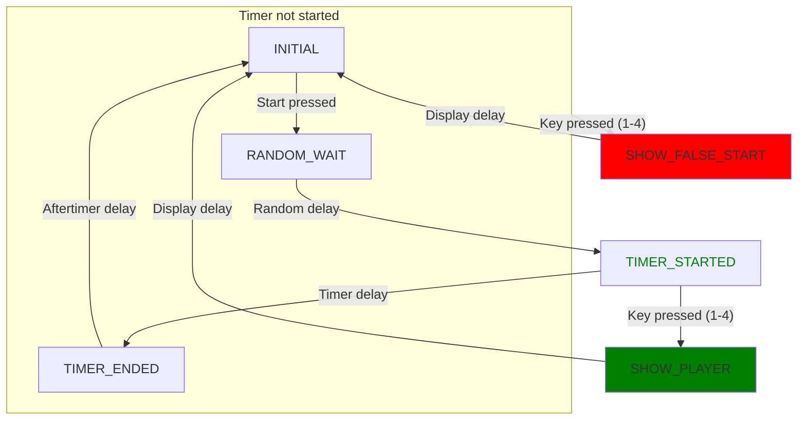

# Hardware and software for Jeopardy-like games

Hardware: control board is based on ESP32 SOC module WROOM-32. It features a 7-segment display to show the players number, small-size speaker for sound signals and few leds to indicate the player, false-start or correct timing signal.
It allows 4 players, each player has his own "console" (push-button and signaling led). Consoles are connected to the control board with phone RJ- connectors and phone wires.

Hardware schematics placed at https://oshwlab.com/alexander.krotov/esp32-knopki

# Железо и софт для "Своей игры"

Железо: основной блок построен на ESP32 модуле (вариант WROOM-32). На блоке есть 7-сегментный индикатор чтобы показывать номер нажавшего игрока, малогабаритная пищалка для звуковых сигналов, зеленый и красный светодиоды для индикации фальстарта или попадания во время, 4 светодиода дублирующие индикацию для выигравшего игрока. "Консольки" игроков состоит из кнопки и светодиода (дополнительная индикация), подключаются через телефонные разъемы телефонными же проводами.
"Консоль" ведущего представляет из себя три кнопки для сброса в начальное состояние и запуска таймеров на 7 и 20 секунд.

На основной плате предусмотрены также выводы для подключения двух внешних светодиодных индикаторов и lcd-дисплея (если когда-нибудь понадобится написать для него софт).

Схему можно найти здесь https://oshwlab.com/alexander.krotov/esp32-knopki

Софт запускает точку доступа Wifi, по ней можно настраивать систему (ssid: knopki, password: knopki73). Имя сети и пароль можно считать по qr-коду на обратной стороне платы (идея неудачная, после монтажа деталей телефон очень плохо распознает qr-код).

## Дизайн железа

Дизайн насколько можно прямолинейный: все кнопки (их 7) замыкают на 0 контакты непосредственно от выводов ESP32, подтянутые к плюсу питания 10к резисторами. (Возможно это и не нужно, можно было обойтись встроенными подтяжками, подтягиваю все кнопки по-привычке.)
Все индикаторные светодиоды (14 каналов) подключены с сдвиговым регистрам 74hc595 (они позволяют чуть больший ток, чем ESP32 и позволяют управлять ими через 3 вывода: 25, 32, 33). Ограничивающие ток резисторы все по 100-200ом (с моими светодиодами токи получались допустимые для сдвиговых регистров и достаточные для светодиодов). 7-сегментный индикатор - первый попавшийся в ящике индикатор с общим анодом (оказался очень ярким, потребовал 200омных резисторов для ограничения тока). 
Пищалка подключена к выводу 26 ESP32 через усилитель тока на одном транзисторе.

Предусмотрен выход для подключения дисплея: 5-контактный разъем H2 с выводом питания и тремя выводами (21, 22, 23) от ESP32 (по предыдущему опыту этого достаточно для подключения небольшого lcd дисплея).

## Дизайн софта

Диаграмма перехода состояний кнопочной системы

Начальное состояние системы: INITIAL. В этом состоянии вся индикация погашена, и мы произвольно долго находимся там пока не будет нажата какая-либо кнопка.

После нажатия одной из двух кнопок старта таймера мы перескакиваем в состояние RANDOM_WAIT. При этом вся индикация погашена.  Запускается внутренний таймер, который срабатывает через A+B*rand(0,1) секунд, то есть случайно, минимум через A, максимум через A+B секунд. A ("Fixed delay") и B ("Random delay") задаются в настройке системы, и могут быть равны 0, тогда мы это состояние проскакиваем мгновенно, и попадаем в TIMER_STARTED.

В состоянии TIMER_STARTED мы включаем все 7 сегментов 7-сегментного индикатора и запускаем внутренний таймер на "Time" (настраивается в конфигурации, типичное значение 7 секунд). В последние 7 секунд мы каждую секунду выключаем по одному сегменту 7-сегментного индикатора (чтобы показать что время истекает). Дабы небыло поутаницы ни в какой момент мы не высвечиваем комбинацию похожую на цифры 1-4. В последние "Countdown beep" секунды подаем короткие звуковые сигналы. После истечения времени переходим в состояние TIMER_ENDED.

В состоянии TIMER_ENDED высвечивается только точка на 7-сегментном экране, и запускается таймер на "Timer pause" секунд. После чего уходим в изначальное состояние INITIAL.

Нажатие на кнопку сброса из любого состояния сбрасывает систему в INITIAL.

Нажатие на кнопки запуска таймера обрабатываются только в состоянии INITIAL. В любом другом состоянии игнорируются.

Нажатие на любую из 4 кнопок игроков в состоянии TIMER_STARTED переводит систему в SHOW_PLAYER. В нем мы на 7-сегментном индикаторе высвечиваем цифру 1-4, зажигаем дополнительные светодиоды на кнопке игрока, и зажигаем зеленый светодиод. То есть всем видом показываем что игрок вовремя нажал на кнопку и может отвечать. В этом состоянии находимся "Display time" секунд, и затем улетаем в INITIAL.

Нажатие на любую из 4 кнопок игроков в состоянии INITIAL или TIMER_WAIT или TIMER_ENDED переводит систему в SHOW_FALSE_START. В нем на 7-сегментном индикаторе мигает цифра 1-4, дается длинный звуковой сигнал, зажигаем дополнительные светодиоды на кнопке игрока, и зажигаем красный светодиод. После чего караем игрока за фальшстарт. В этом состоянии находимся "Display time" секунд, и затем улетаем в INITIAL.

---------------

Нажатие на кнопки обрабатываются обработчиком прерываний (функция ISR).

Основной цикл обновляет дисплей в функции display_updater и проверяет запросы от web-интерфейса.

Параметры конфигурации собраны в структуру keys_config. Изменять настройки можно через web-интерфес по ссылке
http://192.168.4.1 (ssid: knopki, passwd: knopki73). Изменения в конфигурации сохраняются в eeprom (то есть не теряются при следующем включении системы).

Кнопка UPDATE обновляет конфигурацию и сохраняет ее в eeprom. Кнопка LOCK без обновления конфигурации выключает точку доступа, после чего менять конфигурацию уже нельзя до следующго перезапуска системы (никто не сможет, даже случайно, залесть в настройки во время игры).

Пример настроек:

Текущее состояние софта: все закодировано, но еще не тестировалось.

